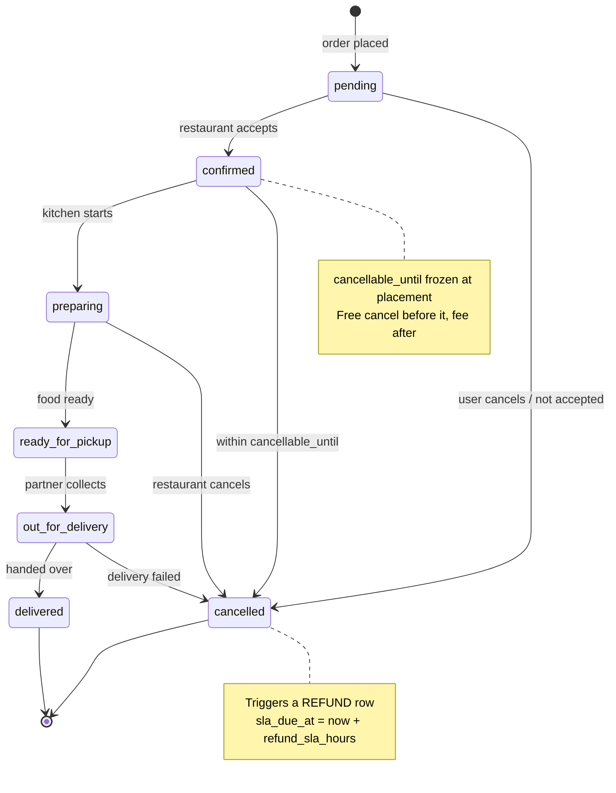

# Foodishi AI — Database Design

Food ordering and AI support platform.
Covers: restaurant discovery, menu Q&A, order placement, order status,
cancellation, refunds, delivery ETA, offers/coupons.

**Stack:** FastAPI · SQLAlchemy 2.0 (async) · PostgreSQL (Supabase) · asyncpg

**Assumptions:** single currency (INR). Currency is already a column, so
relaxing it is additive.

**No longer an assumption:** *"single-tenant — restaurants don't log in yet."*
They do now. `restaurant_staff` and `users.auth_user_id` were added on
2026-08-20 when Supabase Auth moved into phase 1 (see `IMPLEMENTATION_PLAN.md`
D2). §5.8 covers both.

**Table count:** `public` holds **21** tables as of 2026-08-20. Nineteen were
here at the start, `restaurant_staff` made twenty, and `menu_item_images`
arrived alongside from concurrent work (migrations `add_image_url_columns` and
`menu_item_images_gallery`). All twenty-one appear in the diagram in §3;
`menu_item_images` is documented in §5.1.

---

## 1. Three decisions that shape everything

### 1.1 Orders snapshot their own truth

Menu prices change, restaurants rename items, policies get updated. An order from
last Tuesday must still render exactly as it was charged.

`order_items` stores `item_name` and `unit_price` as **copies**, not joins. The FK to
`menu_items` exists for analytics ("how many Paneer Tikkas in March"), never for display.

### 1.2 Policy is frozen into the order at placement

Don't store "cancellation window = 5 min" and recompute later. Store `cancellable_until`
as an actual timestamp on the order.

```
"Can I cancel?"        ->  now() < orders.cancellable_until
"Is my refund late?"   ->  now() > refunds.sla_due_at
```

One comparison each, and both stay correct even if the restaurant changes its policy tomorrow.

### 1.3 Status changes are events, not just a column

`orders.status` is the current state. `order_status_events` is the history.

Support questions like *"when was this confirmed?"* and *"why was it cancelled?"* are
unanswerable without the log.

---

## 2. Enums

| Enum | Values |
|---|---|
| `order_status` | `pending` · `confirmed` · `preparing` · `ready_for_pickup` · `out_for_delivery` · `delivered` · `cancelled` |
| `payment_status` | `pending` · `authorized` · `captured` · `failed` · `refunded` · `partially_refunded` |
| `payment_method` | `upi` · `card` · `netbanking` · `wallet` · `cod` |
| `refund_status` | `initiated` · `processing` · `completed` · `failed` |
| `refund_reason` | `cancelled_by_user` · `cancelled_by_restaurant` · `item_unavailable` · `late_delivery` · `quality_issue` |
| `discount_type` | `flat` · `percent` |
| `coupon_scope` | `global` · `restaurant` · `cuisine` |
| `delivery_status` | `assigned` · `picked_up` · `delivered` · `failed` |
| `spice_level` | `none` · `mild` · `medium` · `hot` |
| `staff_role` | `owner` · `manager` · `staff` |
| `application_status` | `pending` · `approved` · `rejected` |

`staff_role` is deliberately ordered most-privileged first, and the API ranks it
that way: `owner` > `manager` > `staff`. Postgres enum sort order matches, but
nothing depends on that — the ladder lives in `ROLE_RANK` in
`app/dependencies/identity.py`, because a role check is authorization and should
not quietly change if someone reorders the type.

> The existing `order_status` enum in the database needs `ready_for_pickup` added —
> prep done, no rider yet. It's a distinct answer to "where is my order?"

---

## 3. Entity relationship diagram

```mermaid
erDiagram
    USERS ||--o{ ADDRESSES : "has"
    USERS ||--o{ ORDERS : "places"
    USERS ||--o{ COUPON_REDEMPTIONS : "redeems"
    USERS ||--o{ CONVERSATIONS : "opens"
    USERS ||--o{ RESTAURANT_STAFF : "works for"
    USERS ||--o{ RESTAURANT_APPLICATIONS : "applies with"

    RESTAURANTS ||--|| RESTAURANT_POLICIES : "governed by"
    RESTAURANTS ||--o{ RESTAURANT_CUISINES : "tagged"
    CUISINES    ||--o{ RESTAURANT_CUISINES : "tags"
    RESTAURANTS ||--o{ MENU_CATEGORIES : "organizes"
    RESTAURANTS ||--o{ MENU_ITEMS : "offers"
    RESTAURANTS ||--o{ RESTAURANT_STAFF : "staffed by"
    RESTAURANT_APPLICATIONS |o--o| RESTAURANTS : "becomes, once approved"
    MENU_CATEGORIES ||--o{ MENU_ITEMS : "groups"
    MENU_ITEMS ||--o{ MENU_ITEM_IMAGES : "illustrated by"

    RESTAURANTS ||--o{ ORDERS : "fulfils"
    ADDRESSES   ||--o{ ORDERS : "delivered to"
    COUPONS     ||--o{ ORDERS : "discounts"

    ORDERS ||--|{ ORDER_ITEMS : "contains"
    MENU_ITEMS ||--o{ ORDER_ITEMS : "referenced by"
    ORDERS ||--o{ ORDER_STATUS_EVENTS : "logs"

    ORDERS   ||--o{ PAYMENTS : "paid by"
    PAYMENTS ||--o{ REFUNDS : "reversed by"
    ORDERS   ||--o{ REFUNDS : "refunded via"

    COUPONS ||--o{ COUPON_REDEMPTIONS : "redeemed as"
    ORDERS  ||--o| COUPON_REDEMPTIONS : "records"

    ORDERS ||--o| DELIVERIES : "shipped as"
    DELIVERY_PARTNERS ||--o{ DELIVERIES : "carries"

    ORDERS ||--o{ CONVERSATIONS : "discussed in"
    CONVERSATIONS ||--o{ MESSAGES : "contains"

    USERS {
        int id PK
        uuid auth_user_id UK "FK auth.users, nullable"
        varchar name
        varchar email UK
        varchar phone
        varchar city
        bool is_active
        timestamptz created_at
        timestamptz updated_at
    }

    RESTAURANT_APPLICATIONS {
        int id PK
        int applicant_user_id FK "one PENDING row per person"
        enum status "pending, approved, rejected"
        varchar name
        varchar slug "NOT unique here; restaurants.slug is"
        varchar city
        varchar area
        varchar address_line
        numeric latitude
        numeric longitude
        varchar phone
        numeric price_for_two
        int avg_prep_minutes
        time opens_at
        time closes_at
        text note "the applicant, to the operator"
        int reviewed_by_user_id FK "nullable, SET NULL"
        timestamptz reviewed_at
        text decision_note "the operator, to the applicant"
        int restaurant_id FK "what an approval created"
        timestamptz created_at
        timestamptz updated_at
    }

    RESTAURANT_STAFF {
        int id PK
        int user_id FK "unique with restaurant_id"
        int restaurant_id FK
        enum role "owner, manager, staff"
        bool is_active "revoke, do not delete"
        timestamptz created_at
        timestamptz updated_at
    }

    ADDRESSES {
        int id PK
        int user_id FK
        varchar label "home, work"
        varchar line1
        varchar line2
        varchar city
        varchar pincode
        numeric latitude
        numeric longitude
        bool is_default "one per user"
    }

    CUISINES {
        int id PK
        varchar name
        varchar slug UK
    }

    RESTAURANTS {
        int id PK
        varchar name
        varchar slug UK
        text description
        varchar city
        varchar area
        varchar address_line
        numeric latitude
        numeric longitude
        varchar phone
        numeric rating
        int rating_count
        numeric price_for_two
        int avg_prep_minutes "feeds ETA"
        time opens_at
        time closes_at
        bool is_active
        text image_url "nullable"
    }

    RESTAURANT_CUISINES {
        int restaurant_id PK,FK
        int cuisine_id PK,FK
    }

    RESTAURANT_POLICIES {
        int restaurant_id PK,FK
        int cancellation_window_mins
        numeric cancellation_fee_percent
        int refund_sla_hours
        numeric delivery_fee_base
        numeric delivery_fee_per_km
        numeric free_delivery_above "nullable"
        numeric packaging_fee
        numeric min_order_value
        numeric max_delivery_distance_km
    }

    MENU_CATEGORIES {
        int id PK
        int restaurant_id FK
        varchar name
        int sort_order
    }

    MENU_ITEMS {
        int id PK
        int restaurant_id FK
        int category_id FK
        varchar name
        text description
        numeric price
        bool is_veg
        enum spice_level
        int serves
        int calories
        bool is_available
    }

    MENU_ITEM_IMAGES {
        int id PK
        int menu_item_id FK "UK with sort_order"
        text storage_path
        text alt_text "nullable"
        int sort_order "CHECK 0..6"
        int width "nullable"
        int height "nullable"
        int bytes "nullable"
    }

    ORDERS {
        int id PK
        int user_id FK
        int restaurant_id FK
        int address_id FK
        int coupon_id FK "nullable"
        enum status
        numeric subtotal
        numeric packaging_fee
        numeric delivery_fee
        numeric tax_amount
        numeric discount_amount
        numeric total_amount "CHECK reconciles"
        numeric distance_km
        timestamptz placed_at
        timestamptz cancellable_until "frozen policy"
        timestamptz promised_at "quoted ETA"
        timestamptz cancelled_at
        text cancellation_reason
        timestamptz delivered_at
    }

    ORDER_ITEMS {
        int id PK
        int order_id FK
        int menu_item_id FK "analytics only"
        varchar item_name "snapshot"
        numeric unit_price "snapshot"
        int quantity "CHECK gt 0"
        numeric line_total
        text notes
    }

    ORDER_STATUS_EVENTS {
        int id PK
        int order_id FK
        enum from_status
        enum to_status
        varchar actor_type "user, restaurant, system, agent"
        int actor_id
        text reason
        timestamptz created_at
    }

    PAYMENTS {
        int id PK
        int order_id FK
        enum method "upi, card, netbanking, wallet, cod"
        varchar provider
        varchar provider_ref
        numeric amount
        char currency "INR"
        enum status
        timestamptz authorized_at
        timestamptz captured_at
        text failed_reason
    }

    REFUNDS {
        int id PK
        int payment_id FK
        int order_id FK
        numeric amount "partial allowed"
        enum reason
        enum status
        timestamptz sla_due_at "frozen policy"
        timestamptz initiated_at
        timestamptz completed_at
        varchar provider_ref
    }

    COUPONS {
        int id PK
        varchar code UK
        text description
        enum discount_type "flat, percent"
        numeric discount_value
        numeric max_discount_amount "caps percent"
        numeric min_order_value
        enum scope "global, restaurant, cuisine"
        int restaurant_id FK "nullable"
        int cuisine_id FK "nullable"
        timestamptz valid_from
        timestamptz valid_until
        int usage_limit_total
        int usage_limit_per_user
        int times_used
        bool is_active
    }

    COUPON_REDEMPTIONS {
        int id PK
        int coupon_id FK
        int user_id FK
        int order_id FK,UK
        numeric discount_applied
        timestamptz redeemed_at
    }

    DELIVERY_PARTNERS {
        int id PK
        varchar name
        varchar phone
        varchar vehicle_type
        bool is_available
    }

    DELIVERIES {
        int id PK
        int order_id FK,UK
        int partner_id FK
        numeric distance_km
        int eta_minutes
        enum status
        timestamptz assigned_at
        timestamptz picked_up_at
        timestamptz delivered_at
    }

    CONVERSATIONS {
        int id PK
        int user_id FK
        int order_id FK "nullable"
        varchar status
        timestamptz created_at
    }

    MESSAGES {
        int id PK
        int conversation_id FK
        varchar role "user, assistant, tool"
        text content
        varchar tool_name
        jsonb tool_payload
        timestamptz created_at
    }
```



---

## 4. Order lifecycle



---

## 5. Tables

### 5.1 Catalog

| Table | Key columns |
|---|---|
| `cuisines` | `id`, `name`, `slug` |
| `restaurants` | `id`, `name`, `slug` UQ, `description`, `city`, `area`, `address_line`, `latitude`, `longitude`, `phone`, `rating numeric(2,1)`, `rating_count`, `price_for_two`, `avg_prep_minutes`, `opens_at time`, `closes_at time`, `is_active` |
| `restaurant_cuisines` | `restaurant_id`, `cuisine_id` — composite PK |
| `menu_categories` | `id`, `restaurant_id`, `name`, `sort_order` |
| `menu_items` | `id`, `restaurant_id`, `category_id`, `name`, `description`, `price numeric(10,2)`, `is_veg`, `spice_level`, `serves`, `calories`, `is_available` |
| `menu_item_images` | `id`, `menu_item_id` FK cascade, `storage_path`, `alt_text`, `sort_order`, `width`, `height`, `bytes` |

`avg_prep_minutes` is what makes a promised ETA defensible rather than invented.

`restaurants.image_url` is a single nullable `text` cover image. Dish photography
is the one place the schema does more work: `menu_item_images` is a gallery of up
to seven photos per item, and the cap is structural rather than advisory —
`sort_order` carries `CHECK (sort_order BETWEEN 0 AND 6)` and a
`UNIQUE (menu_item_id, sort_order)`, so the database itself cannot hold an eighth
row and position 0 is unambiguously the cover. No trigger, and no service check a
future endpoint can forget to call. The column stores a **path, not a URL**, so
the CDN host can change without rewriting every row; the bucket is `menu-images`
(see `app/models/media.py`, `MAX_IMAGES_PER_ITEM`/`STORAGE_BUCKET`). The table has
a model and a live table but no endpoint yet — uploads are still to be built.

### 5.2 Policy

One row per restaurant. PK **is** the FK.

```sql
CREATE TABLE restaurant_policies (
    restaurant_id             int PRIMARY KEY REFERENCES restaurants(id),
    cancellation_window_mins  int          NOT NULL,  -- free-cancel period
    cancellation_fee_percent  numeric(5,2) NOT NULL,
    refund_sla_hours          int          NOT NULL,  -- money back within N hours
    delivery_fee_base         numeric(10,2) NOT NULL,
    delivery_fee_per_km       numeric(10,2) NOT NULL,
    free_delivery_above       numeric(10,2),          -- nullable
    packaging_fee             numeric(10,2) NOT NULL,
    min_order_value           numeric(10,2) NOT NULL,
    max_delivery_distance_km  numeric(4,1)  NOT NULL
);
```

This is the table the support agent reads to answer *"why was I charged ₹40 delivery?"*
and *"when will I get my refund?"*

### 5.3 Ordering

```sql
addresses
  id, user_id FK, label, line1, line2, city, pincode,
  latitude, longitude, is_default
  -- partial unique index: one default per user

orders
  id, user_id FK, restaurant_id FK, address_id FK, coupon_id FK NULL
  status              order_status
  subtotal            numeric(10,2)
  packaging_fee       numeric(10,2)
  delivery_fee        numeric(10,2)
  tax_amount          numeric(10,2)
  discount_amount     numeric(10,2)
  total_amount        numeric(10,2)
  distance_km         numeric(4,1)
  placed_at           timestamptz
  cancellable_until   timestamptz   -- frozen policy
  promised_at         timestamptz   -- ETA quoted to the customer
  cancelled_at        timestamptz NULL
  cancellation_reason text NULL
  delivered_at        timestamptz NULL
  created_at, updated_at

order_items
  id, order_id FK, menu_item_id FK
  item_name    varchar        -- snapshot
  unit_price   numeric(10,2)  -- snapshot
  quantity     int CHECK (quantity > 0)
  line_total   numeric(10,2)
  notes        text

order_status_events
  id, order_id FK, from_status, to_status,
  actor_type ('user'|'restaurant'|'system'|'agent'), actor_id,
  reason, created_at
```

**Money invariant, enforced by the database:**

```sql
ALTER TABLE orders ADD CONSTRAINT orders_total_reconciles CHECK (
    total_amount = subtotal + packaging_fee + delivery_fee
                 + tax_amount - discount_amount
);
ALTER TABLE orders ADD CONSTRAINT orders_discount_bounded CHECK (
    discount_amount <= subtotal
);
```

Worth more than any test — a pricing bug becomes an insert failure instead of a wrong charge.

### 5.4 Payments and refunds

```sql
payments
  id, order_id FK, method, provider, provider_ref,
  amount numeric(10,2), currency char(3) DEFAULT 'INR',
  status payment_status,
  authorized_at, captured_at, failed_reason

refunds
  id, payment_id FK, order_id FK,
  amount numeric(10,2), reason refund_reason, status refund_status,
  sla_due_at   timestamptz,   -- initiated_at + policy.refund_sla_hours
  initiated_at, completed_at, provider_ref
```

Two things the ER diagram encodes that are easy to miss:

- **`orders -> payments` is one-to-many, not one-to-one.** A UPI attempt fails, the
  customer retries with a card: two payment rows, one order. Modelling it 1:1 forces
  you to overwrite the failure and lose the record.
- **Refunds are a separate table, not a nullable column.** Partial and multiple refunds
  per order are both normal (one item unavailable, then a late-delivery goodwill credit).

### 5.5 Offers and coupons

```sql
coupons
  id, code UQ, description,
  discount_type, discount_value numeric(10,2),
  max_discount_amount numeric(10,2) NULL,   -- caps percent coupons
  min_order_value numeric(10,2),
  scope coupon_scope, restaurant_id FK NULL, cuisine_id FK NULL,
  valid_from, valid_until,
  usage_limit_total int NULL, usage_limit_per_user int,
  times_used int DEFAULT 0,
  is_active bool

coupon_redemptions
  id, coupon_id FK, user_id FK, order_id FK UQ,
  discount_applied numeric(10,2), redeemed_at
```

`max_discount_amount` is the one people forget — "20% off" without a cap is an unbounded
liability. Per-user limits are enforced by counting `coupon_redemptions`, which doubles
as the fraud trail.

### 5.6 Delivery and ETA

```sql
delivery_partners
  id, name, phone, vehicle_type, is_available

deliveries
  id, order_id FK UNIQUE, partner_id FK,
  distance_km, eta_minutes, status delivery_status,
  assigned_at, picked_up_at, delivered_at
```

ETA formula — every input already lives in the schema:

```
promised_at = placed_at
            + restaurants.avg_prep_minutes
            + (distance_km / avg_speed_kmph * 60)
            + dispatch_buffer
```

### 5.7 Support conversations

Tables now, AI later. No embeddings, no vector column.

```sql
conversations  id, user_id FK, order_id FK NULL, status, created_at
messages       id, conversation_id FK, role, content,
               tool_name, tool_payload jsonb, created_at
```

When semantic menu search is worth adding, it's an additive migration — `pgvector` is
available on the Supabase instance, just not installed.

### 5.8 Identity and restaurant staff

Added 2026-08-20, when D2 reversed and Supabase Auth became phase-1 scope.
Supabase Auth answers *who is this*; these two things answer *what may they
touch*.

```sql
ALTER TABLE users
    ADD COLUMN auth_user_id uuid UNIQUE
        REFERENCES auth.users(id) ON DELETE SET NULL;

CREATE TABLE restaurant_staff (
    id            serial PRIMARY KEY,
    user_id       int  NOT NULL REFERENCES users(id)       ON DELETE CASCADE,
    restaurant_id int  NOT NULL REFERENCES restaurants(id) ON DELETE CASCADE,
    role          staff_role NOT NULL,
    is_active     bool NOT NULL,
    created_at    timestamptz NOT NULL DEFAULT now(),
    updated_at    timestamptz NOT NULL DEFAULT now(),
    CONSTRAINT uq_staff_user_restaurant UNIQUE (user_id, restaurant_id)
);
CREATE INDEX ix_restaurant_staff_user_id     ON restaurant_staff (user_id);
CREATE INDEX ix_restaurant_staff_restaurant  ON restaurant_staff (restaurant_id);
```

**`auth_user_id` is nullable, and stays nullable.** 150 seeded users have no
Supabase identity and never will; neither does anyone created through
`POST /users` before signing in. A `NOT NULL` here would mean either inventing
auth accounts for fixtures or refusing to seed. `ON DELETE SET NULL` rather than
`CASCADE`: deleting an auth account must not delete a profile that eight hundred
orders point at. The profile survives, orphaned and inert, which is the correct
outcome — the order history is still true.

**`is_active` rather than deleting the row.** Revoking access should not destroy
the answer to *"who accepted this order in March?"*. The unique constraint is on
`(user_id, restaurant_id)` with no `is_active` in it, so re-adding a revoked
person updates the existing row rather than creating a second — one row per
person per restaurant, forever.

**One person, several restaurants** is expressed by several rows, each with its
own role. A regional manager over three outlets is three rows; the API checks
the row matching the `restaurant_id` in the path, so there is no such thing as
an ambient permission.

#### Why the profile stays in `public.users`

The obvious-looking simplification is to delete `public.users` and keep
everything in `auth.users` — one identity table, no join, no nullable link.
It was rejected, for four reasons in descending order of how expensive the
mistake would have been:

1. **Four tables already reference `users.id` as an integer FK** — `addresses`,
   `orders`, `coupon_redemptions`, and now `restaurant_staff`, plus
   `conversations`. Collapsing means rewriting every one of those to `uuid`,
   re-seeding 800 orders, and losing the constraint coverage during the
   migration. The join being avoided is a single indexed integer lookup.
2. **`auth.users` is Supabase-managed.** It is their schema, their migrations,
   their columns. Adding `city` or `avatar_url` to it means either abusing
   `raw_user_meta_data` — unconstrained, untyped JSON that no CHECK can defend —
   or writing to a table the platform reserves the right to alter.
3. **Not every user is an account.** Seed data, an ops-created profile, a phone
   order taken by support. A profile without an identity must be legal; the
   reverse (identity without a profile) is the state `POST /auth/link`
   exists to resolve.
4. **It keeps auth swappable.** Everything downstream of the token knows only
   `users.id`. Replacing Supabase Auth means repointing one nullable column and
   `app/services/auth.py`, not the whole schema.

The cost is one extra column and one lookup per authenticated request. The
lookup is on a unique index; this is not the query that will be slow.

#### RLS on these tables, and on all the others

Every table in `public` has row-level security **enabled** and **zero policies**
— verified 2026-08-20 across all 21, `restaurant_staff` included. That
combination denies everything to every role except `postgres` and other
`BYPASSRLS` roles.

That is intentional, and it is worth being precise about why, because "RLS on,
no policies" reads like an unfinished job:

- **The API is the only client, and it connects as `postgres`.** It bypasses
  RLS entirely. Authorization happens in `require_staff()` and `CurrentUser`,
  in application code, where it can return a 403 with a reason instead of an
  empty result set. Policies would be a second, silently-diverging copy of the
  same rules.
- **RLS stays on anyway because the publishable key is a live exposure vector.**
  Supabase exposes every `public` table through PostgREST at a URL that is
  reachable from the internet right now, authenticated by a key that is designed
  to ship inside a browser bundle. The only thing standing between that key and
  the entire orders table is RLS being enabled. The moment anyone adds
  `supabase-js` to the customer or partner app — which `MONOREPO_PLAN.md` has
  them doing for sign-in — that key is public by design.
- **So the rule is:** RLS enabled on every new table, in the same migration that
  creates it, with no policies. Do not "clean up" the enabled flag on the
  grounds that nothing uses it. It is doing work precisely because nothing
  uses it.

If PostgREST ever becomes a real client, policies stop being optional and the
first two must be `users` (a row is yours when `auth_user_id = auth.uid()`) and
`restaurant_staff` (a row is visible to staff of that restaurant). Until then,
enabled-and-empty is the deny-by-default posture, not a to-do.

### 5.9 Restaurants asking to join

Added 2026-08-22, when self-serve onboarding landed. Until then the only way onto
the platform was `POST /restaurants`, which is platform-staff-only — so every
restaurant arrived because a Foodishi operator typed it in, and a restaurateur
who found the site had nowhere to go.

```sql
CREATE TABLE restaurant_applications (
    id                  serial PRIMARY KEY,
    applicant_user_id   int NOT NULL REFERENCES users(id) ON DELETE CASCADE,
    status              application_status NOT NULL DEFAULT 'pending',

    -- The restaurant as proposed. Every column `restaurants` requires.
    name                varchar(160) NOT NULL,
    slug                varchar(180) NOT NULL,
    description         text,
    city                varchar(60)  NOT NULL,
    area                varchar(80)  NOT NULL,
    address_line        varchar(240) NOT NULL,
    latitude            numeric(9,6) NOT NULL,
    longitude           numeric(9,6) NOT NULL,
    phone               varchar(20)  NOT NULL,
    price_for_two       numeric(10,2) NOT NULL,
    avg_prep_minutes    int NOT NULL,
    opens_at            time NOT NULL,
    closes_at           time NOT NULL,
    note                text,

    -- How it was answered.
    reviewed_by_user_id int REFERENCES users(id)       ON DELETE SET NULL,
    reviewed_at         timestamptz,
    decision_note       text,
    restaurant_id       int REFERENCES restaurants(id) ON DELETE SET NULL,

    created_at          timestamptz NOT NULL DEFAULT now(),
    updated_at          timestamptz NOT NULL DEFAULT now()
);

CREATE UNIQUE INDEX uq_one_pending_application_per_user
    ON restaurant_applications (applicant_user_id) WHERE status = 'pending';
CREATE INDEX ix_restaurant_applications_status_created
    ON restaurant_applications (status, created_at);
CREATE INDEX ix_restaurant_applications_applicant_user_id
    ON restaurant_applications (applicant_user_id);
```

**Why a separate table rather than a status column on `restaurants`.** A
`restaurants` row is reachable by every catalog query, every scope check and
every report on the platform. Making "not accepted yet" one more value all of
those have to exclude means every one of them is a place to forget it, and the
first forgotten one publishes a kitchen nobody approved. A separate table cannot
be forgotten by a query that never names it.

**The details are copied, not referenced.** There is no restaurant to point at
until an approval mints one — this is the only table in the schema whose row
describes something that does not exist. `app/services/onboarding.DETAIL_COLUMNS`
is the explicit list of what gets copied across, named rather than derived so a
column added here for the operator's benefit (a score, a source, an internal
note) cannot silently become a column written to `restaurants`.

**`slug` is not unique here, deliberately.** Two applicants may propose the same
one and both rows are legitimate until one is approved. Uniqueness belongs to
`restaurants.slug`, where it already exists, and the approval reports the clash;
enforcing it here as well would refuse the second applicant for something the
first had not been granted yet. Submission still checks the slug against live
restaurants as a courtesy — it is the one field an applicant cannot change later
without breaking every link to them.

**One PENDING row per person, and only pending.** The partial unique index is
what makes a double-tapped submit button harmless. A rejected applicant may apply
again and an approved one may apply for a second restaurant; nobody can sit in
the operator's queue twice at once.

**Approval creates the restaurant with `is_active = false`.** Discovery filters
on that column alone, so an approved kitchen is invisible to customers until its
own owner opens it — by which time they have had the chance to write a policy and
a menu. Approving and publishing are two decisions taken by two different people,
and collapsing them means every approval publishes a kitchen with no food on it,
which fails at the customer's checkout rather than in the operator's console.
`POST /restaurants` was changed to default the same way.

**Nothing is deleted on a refusal.** The row stays with its reason, because
*"did we already turn these people down, and why"* is a question an operator asks
about a resubmission, and because that reason is the only thing the applicant can
act on. `reviewed_by_user_id` is `users.id` rather than `platform_staff.id` and
`ON DELETE SET NULL`: a person can leave Foodishi and lose their platform row,
and the record of who approved a restaurant must outlive their employment.

---

## 6. Indexes for day one

```sql
CREATE INDEX ON orders (user_id, placed_at DESC);            -- "my orders"
CREATE INDEX ON orders (restaurant_id, status);              -- restaurant dashboard
CREATE INDEX ON orders (status)
    WHERE status NOT IN ('delivered', 'cancelled');          -- live board
CREATE INDEX ON order_items (order_id);
CREATE INDEX ON order_status_events (order_id, created_at);
CREATE INDEX ON menu_items (restaurant_id) WHERE is_available;
CREATE INDEX ON restaurants (city) WHERE is_active;
CREATE INDEX ON payments (order_id);
CREATE INDEX ON refunds (order_id);
CREATE INDEX ON coupon_redemptions (coupon_id, user_id);
CREATE UNIQUE INDEX ON addresses (user_id) WHERE is_default;
CREATE INDEX ON restaurant_staff (user_id);                  -- "my restaurants"
CREATE INDEX ON restaurant_staff (restaurant_id);            -- "who works here"
CREATE UNIQUE INDEX ON users (auth_user_id);                 -- every authed request
```

`users (auth_user_id)` is the hottest of these: one lookup on every
authenticated request, turning a token's `sub` into the integer id the rest of
the schema speaks. It comes free with the UNIQUE constraint.

---

## 7. Seed plan

Fixed RNG seed, so every run produces an identical dataset — otherwise tests drift.

| Data | Volume |
|---|---|
| Cuisines | 8 — North Indian, South Indian, Chinese, Biryani, Pizza, Desserts, Beverages, Street Food |
| Restaurants | **25** across 3 cities, each with a policy row |
| Menu categories | 4–6 per restaurant |
| Menu items | 18–28 per restaurant ≈ **550** |
| Users / addresses | 150 / ~280 |
| Orders | **800** over 90 days |
| Order items | 1–5 per order ≈ 2,400 |
| Payments | 1+ per order, ~4% failed with retry |
| Refunds | ~8% of orders, mixed statuses |
| Coupons | 10 — flat, percent-with-cap, restaurant-scoped, expired, exhausted |
| Deliveries | every order past `preparing` |
| **Restaurant staff** | **0 rows today — not seeded.** Needs 1 `owner` per restaurant plus a few `manager` / `staff`, or every scoped route 403s |

Status distribution roughly **70% delivered · 12% cancelled · 18% live states**, so the
support flows have real material to answer against.

Deliberately seed these edge cases:

- an order still inside its cancellation window
- an order just past it (cancellation now incurs a fee)
- a refund breaching its SLA
- a coupon at its usage limit
- a payment that failed and was retried successfully

---

## 8. Build order

| # | Step | Why it's here |
|---|---|---|
| 1 | **Alembic baseline** | Stamp `users` + `orders` as-is, then every table below is a migration. `create_all` only ever creates — it never alters. Drift has already started (`users.updated_at` exists in the DB but not in the model). |
| 2 | Catalog + seed script | cuisines -> restaurants -> policies -> categories -> items |
| 3 | Addresses, extended `orders`, `order_items`, `order_status_events` | |
| 4 | **Pricing service** | One function computing subtotal -> fees -> discount -> total, called by both the API and the seeder so they cannot disagree |
| 5 | Payments + refunds | |
| 6 | Coupons + redemption validation | |
| 7 | Delivery + ETA | |
| 8 | **`users.auth_user_id` + `restaurant_staff`** | Applied 2026-08-20, out of order, because D2 reversed mid-build. Retrofitting the scope checks onto endpoints already written is the cost of that ordering — see `IMPLEMENTATION_PLAN.md` Step 15 |

---

## 9. Open items

- **RLS**: settled, and it needs maintaining. All 21 tables have RLS enabled
  with no policies (§5.8). The hazard is `create_all`, which creates tables with
  RLS *off* — a table added through the model without a matching
  `ALTER TABLE ... ENABLE ROW LEVEL SECURITY` is exposed through PostgREST to
  the publishable key from the moment it exists. Every new table's migration
  must carry that line.
- **Auth**: the verification layer and the identity endpoints are built and
  verified against the live project — `app/services/auth.py`,
  `app/dependencies/identity.py`, `app/dependencies/scope.py`, plus the nine
  routes in `app/routers/me.py` and `app/routers/staff.py`. **The retrofit onto
  the other endpoints is half done.** Catalog admin, `GET /orders`,
  `PATCH /orders/{id}/status` and `PATCH /deliveries/{id}` are scoped; users,
  addresses, payments, refunds, coupons and the remaining order routes are not,
  so anyone can still `PATCH` or `DELETE` any user by guessing an integer id.
  That is `IMPLEMENTATION_PLAN.md` Step 15, and it is the gap between "auth
  exists" and "the API is protected".
- **`restaurant_staff` is seeded** — the invariant to rely on is that *every
  restaurant has at least one active owner*, with a mix of `owner`, `manager`
  and `staff` rows and a few deliberately inactive ones. The earlier blocker
  ("zero rows, so every scoped route 403s for everyone") is resolved. Exact row
  counts are deliberately not quoted here: the seeder is re-run routinely and
  the totals drift (observed moving between 75 and 80 rows, and 25 to 27
  restaurants, within a single afternoon). Assert the invariant, not a number.
- **No `users` row has an `auth_user_id` yet** — all 150 are null, which is the
  expected state for seed data. A row acquires one when the real person signs in
  and calls `POST /auth/link` with the same e-mail; that endpoint exists and is
  the only way it happens. Note the path: `identity.py`'s `PROFILE_LINK_PATH` is
  `/auth/link`, not the `/auth/profile` earlier drafts named.
- **Tests**: no suite yet.
